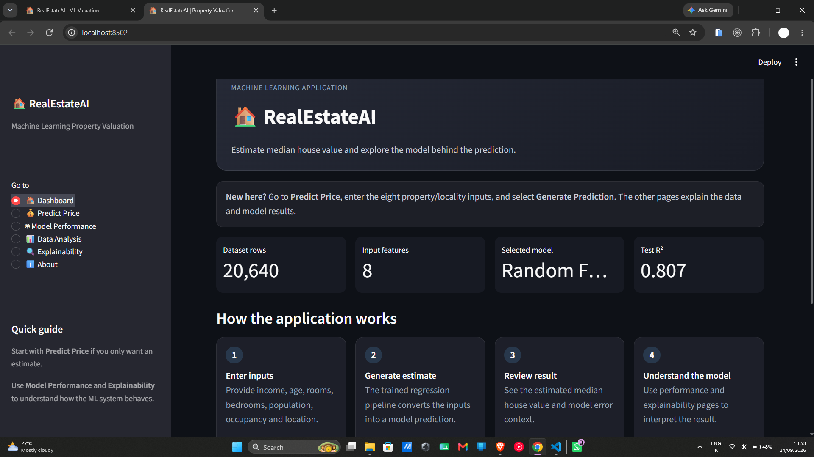
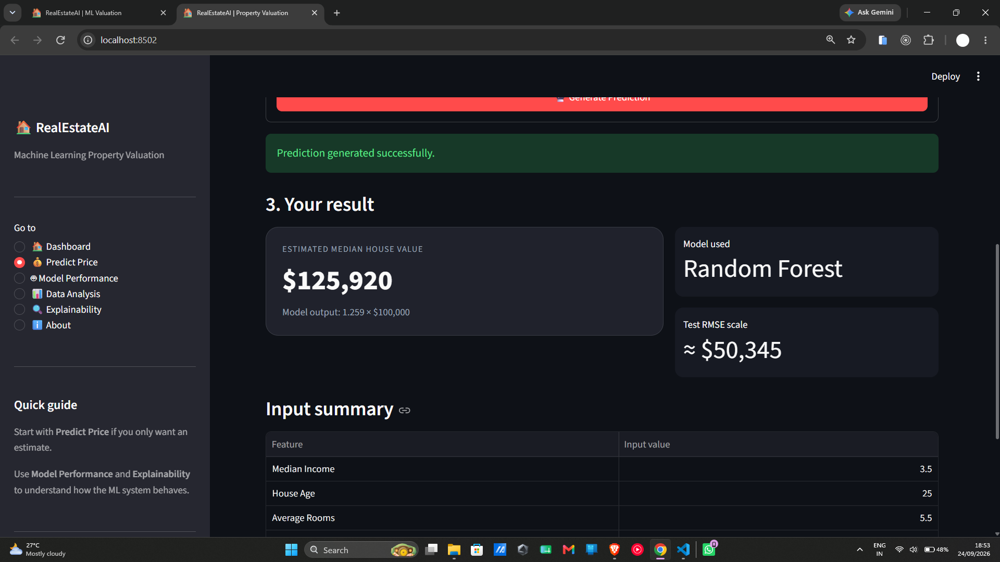
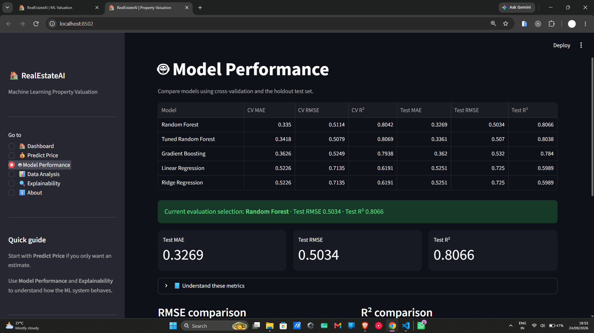
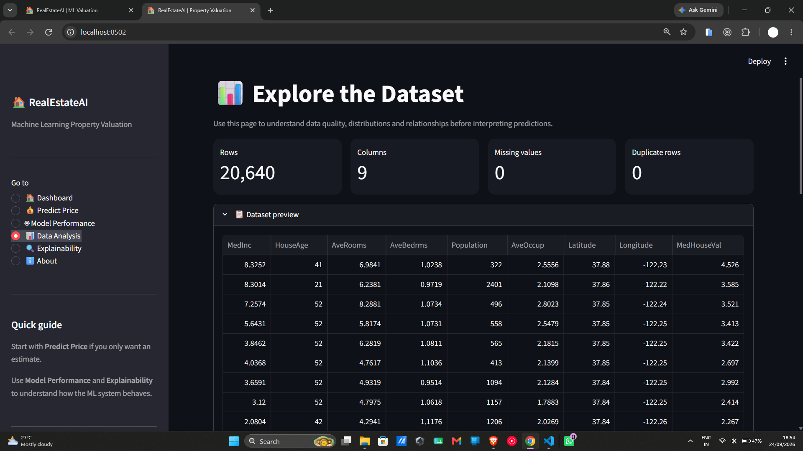
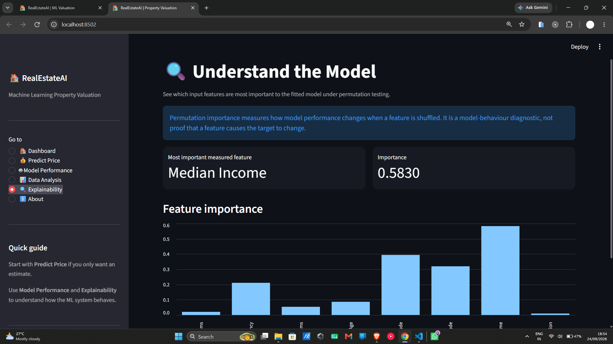

# 🏠 RealEstateAI — Machine Learning Property Valuation

An end-to-end **Machine Learning + Streamlit** application for estimating median house value from property and locality characteristics using the California Housing benchmark dataset.

> **Academic / Industrial Training Project**
>
> This repository is an original modular implementation built for learning, experimentation and industrial-training documentation. It is an educational prediction system, not a professional property appraisal service.

## ✨ Features

- 📥 Automated California Housing dataset loading through scikit-learn
- ✅ Dataset validation and quality checks
- 🧩 Feature engineering with ratio-based features
- ⚙️ Scikit-learn preprocessing pipeline
- 🤖 Multiple regression models:
  - Linear Regression
  - Ridge Regression
  - Random Forest Regressor
  - Gradient Boosting Regressor
- 🔧 Randomized hyperparameter search for Random Forest
- 📊 Cross-validation and holdout evaluation
- 📐 MAE, RMSE and R² metrics
- 🔍 Permutation-based feature importance
- 💻 Interactive Streamlit dashboard
- 🧪 Unit tests for validation and feature engineering
- 📁 Modular project structure suitable for further extension

## 🖥️ Application Screenshots

### Dashboard



### Prediction Result



### Model Performance



### Data Analysis



### Explainability



## 🧠 Project Workflow

```text
Dataset
   ↓
Data Validation
   ↓
Feature Engineering
   ↓
Preprocessing
   ↓
Model Training
   ↓
Cross-Validation
   ↓
Hyperparameter Search
   ↓
Holdout Evaluation
   ↓
Explainability
   ↓
Streamlit Prediction Dashboard
```

## 🏗️ Architecture

```text
┌──────────────────────────┐
│ California Housing Data  │
└────────────┬─────────────┘
             ↓
┌──────────────────────────┐
│ Data Validation          │
│ Missing / Type / Duplic. │
└────────────┬─────────────┘
             ↓
┌──────────────────────────┐
│ Feature Engineering      │
│ Rooms / Bedroom Ratios   │
└────────────┬─────────────┘
             ↓
┌──────────────────────────┐
│ Preprocessing Pipeline   │
│ Imputation + Scaling     │
└────────────┬─────────────┘
             ↓
┌──────────────────────────┐
│ Regression Models        │
│ LR / Ridge / RF / GB     │
└────────────┬─────────────┘
             ↓
┌──────────────────────────┐
│ CV + Hyperparameter      │
│ Search + Evaluation      │
└────────────┬─────────────┘
             ↓
┌──────────────────────────┐
│ Model + Metadata         │
│ + Metrics + Importance   │
└────────────┬─────────────┘
             ↓
┌──────────────────────────┐
│ Streamlit Web Dashboard  │
└──────────────────────────┘
```

## 📊 Dataset

The application uses the **California Housing** benchmark dataset provided through `sklearn.datasets.fetch_california_housing`.

The prediction target is `MedHouseVal`, representing median house value in units of **$100,000**.

| Feature | Meaning |
|---|---|
| `MedInc` | Median income in the block group |
| `HouseAge` | Median house age |
| `AveRooms` | Average number of rooms |
| `AveBedrms` | Average number of bedrooms |
| `Population` | Block-group population |
| `AveOccup` | Average household occupancy |
| `Latitude` | Geographic latitude |
| `Longitude` | Geographic longitude |

Additional engineered features:

- `RoomsPerBedroom`
- `BedroomsPerRoom`

### Dataset limitation

This is aggregated benchmark data at the block-group level. It is **not** a database of individual property listings and does not represent live Indian or local real-estate prices.

## 📈 Example Evaluation Results

One validated project run produced the following holdout-test results:

| Model | Test MAE | Test RMSE | Test R² |
|---|---:|---:|---:|
| Random Forest | 0.3269 | 0.5034 | 0.8066 |
| Tuned Random Forest | 0.3361 | 0.5070 | 0.8038 |
| Gradient Boosting | 0.3620 | 0.5320 | 0.7840 |
| Linear Regression | 0.5251 | 0.7250 | 0.5989 |
| Ridge Regression | 0.5251 | 0.7250 | 0.5989 |

Metrics are dataset- and split-specific and should be regenerated with `python train.py` rather than treated as universal performance guarantees.

## 📁 Project Structure

```text
RealEstateAI_Industrial_Project/
│
├── app.py                         # Streamlit application
├── train.py                       # Training + evaluation pipeline
├── evaluate.py                    # Evaluation utilities/entry point
├── predict.py                     # Prediction helper
├── requirements.txt               # Python dependencies
├── .gitignore
├── README.md
│
├── src/
│   ├── __init__.py
│   ├── config.py                  # Paths, features and constants
│   ├── data_loader.py             # Dataset loading
│   ├── validation.py              # Data validation
│   ├── feature_engineering.py     # Derived features
│   ├── preprocessing.py           # sklearn preprocessing pipeline
│   ├── modeling.py                # Regression models + tuning space
│   ├── evaluation.py              # CV and regression metrics
│   └── explainability.py          # Permutation importance
│
├── tests/
│   ├── test_feature_engineering.py
│   └── test_validation.py
│
├── models/
│   └── .gitkeep                   # Generated model artifacts are ignored
│
├── data/
│   ├── raw/.gitkeep
│   └── processed/.gitkeep
│
├── outputs/
│   ├── metrics/.gitkeep
│   └── plots/.gitkeep
│
└── docs/
    ├── PROJECT_DOCUMENTATION.md
    ├── REPORT_MAPPING.md
    └── screenshots/
```

## 🚀 Installation — Windows PowerShell

### 1. Clone the repository

```powershell
git clone https://github.com/YOUR-USERNAME/RealEstateAI.git
cd RealEstateAI
```

### 2. Create a virtual environment

```powershell
python -m venv .venv
.\.venv\Scripts\Activate.ps1
```

If PowerShell blocks activation:

```powershell
Set-ExecutionPolicy -Scope Process -ExecutionPolicy Bypass
.\.venv\Scripts\Activate.ps1
```

### 3. Install dependencies

```powershell
python -m pip install --upgrade pip
pip install -r requirements.txt
```

## 🏋️ Train the ML models

Run this before opening the dashboard on a fresh clone:

```powershell
python train.py
```

The training pipeline downloads/loads the California Housing dataset and generates model artifacts under `models/` and evaluation files under `outputs/`.

Typical generated files include:

```text
models/
├── best_model.joblib
└── model_metadata.json

outputs/metrics/
├── model_metrics.csv
├── cross_validation.csv
└── feature_importance.csv

outputs/plots/
├── target_distribution.png
├── correlation_heatmap.png
├── model_comparison.png
├── feature_importance.png
└── residuals.png
```

These generated artifacts are intentionally ignored by Git so the repository stays lightweight and reproducible.

## ▶️ Run the Streamlit application

```powershell
streamlit run app.py
```

Then open the local URL displayed by Streamlit, usually:

```text
http://localhost:8501
```

### Recommended user flow

1. Open **Dashboard** for an overview.
2. Go to **Predict Price**.
3. Enter the eight input features.
4. Click **Generate Prediction**.
5. Review the estimate and model-error context.
6. Open **Model Performance** to compare regression models.
7. Open **Data Analysis** to inspect the dataset.
8. Open **Explainability** to understand feature importance.

## 🧪 Run tests

```powershell
pytest -q
```

## 🔬 Reproducibility

The project uses fixed random seeds where supported (`RANDOM_STATE = 42`) and a fixed test split configuration. Training artifacts are generated locally so another user can reproduce the workflow with the same code and dependencies.

## ⚠️ Limitations

- Uses a California benchmark dataset rather than live market data.
- Predictions represent a benchmark median house-value target, not a specific property's sale price.
- Geographic and property-market factors outside the dataset are not modeled.
- Model performance can change with different data splits, versions and datasets.
- Feature importance describes model behaviour and should not be interpreted as causal evidence.

## 🔮 Future Scope

- Replace the benchmark dataset with a verified Indian/regional property dataset.
- Add interactive maps and richer geospatial features.
- Add a FastAPI prediction service.
- Add a database for prediction history.
- Add authentication and role-based access.
- Add model monitoring and data-drift detection.
- Add automated retraining.
- Add Docker and CI/CD.
- Deploy the application using a suitable cloud platform.

## 🎓 Academic Use

This project is intended for **educational and industrial-training purposes**. Before presenting the project, understand the data pipeline, model training process, evaluation metrics and application code. Replace any personal/institutional placeholders with your actual details.

## 👨‍💻 Author

**Asif Mallick**  
Diploma in Computer Science & Engineering  
Brainware University

---

⭐ If you find this project useful for learning, consider starring the repository.
